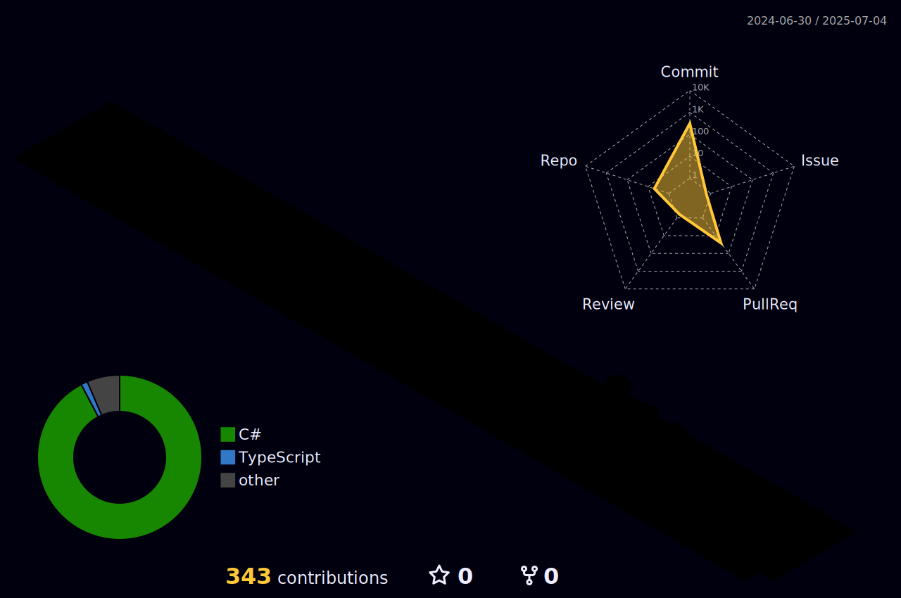

  

<h1 align="center">Olá! Eu sou o Levy Arthur 👋</h1>

💻 Desenvolvedor | 🚀 Estudante

  
  <!---->
  

---

## 💡 Sobre mim

- 🌱 Atualmente aprendendo: **TypeScript, React, Nginx**
- 🧠 Interesses: **Qualquer área relacionada ao desenvolvimento de software**
- ⚙️ Ferramentas favoritas: .NET, SqlServer, Docker, Microsoft Visual Studio, Figma
- 🎯 Buscando colaborar com projetos que fazem a diferença

---

## 🚀 Minhas Tecnologias

  

---

## 📊 Meus Dados no GitHub

<!--
---

## 🧩 Snake de Contribuição

---
-->

## 🧠 Projetos em Destaque

| Projeto | Descrição | Tecnologias |
|--------|-----------|-------------|
| [🔗 Gerenciamento de obras](https://github.com/levyath/Api_Gerenciamento_de_obras) | Um projeto legal que busca trazer uma introdução ao uso de nest.js para construção de uma api que gerencia obras | React, Node.js |
<!--| [🔗 Outro Projeto](https://github.com/seuusuario/projeto2) | Automatiza tarefas com IA | Python, OpenAI API |-->

---

## 📬 Contato

  <a href="mailto:levy.arthur.s.b@gmail.com">📩 Me envie um email</a> •
  <a href="https://linkedin.com/in/levy-arthur-998151219/">📎 LinkedIn</a> •
  <!--<a href="https://seuportfolio.com">🌐 Portfólio</a>-->

---

  Feito com ❤️ por <strong>Levy Arthur</strong>

